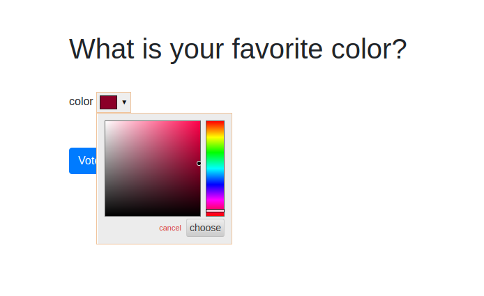
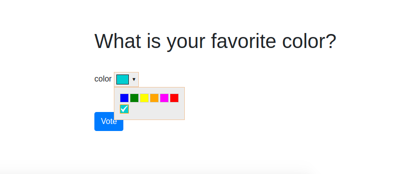
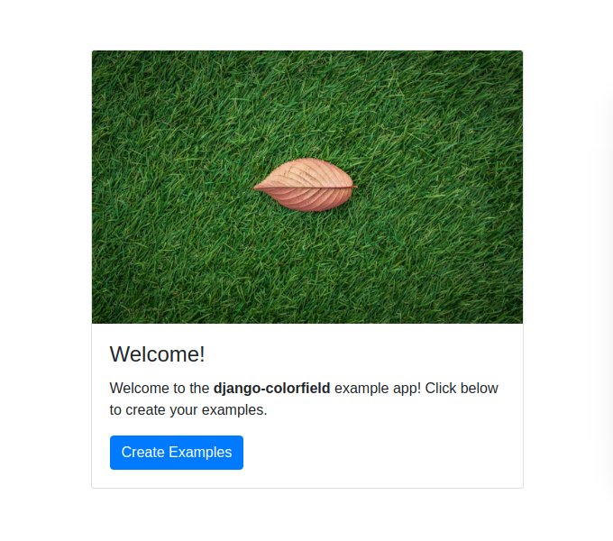
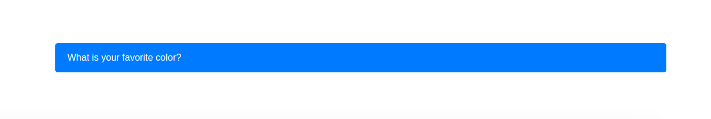
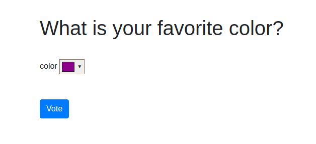
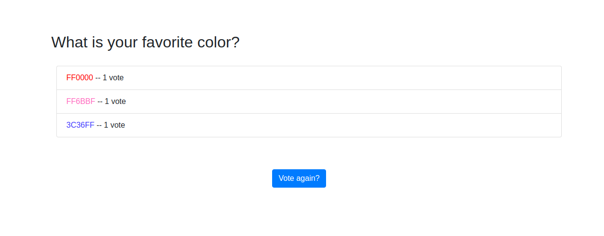

# django-colorfield-example

This is the example Django polls app with fields that demonstrate the colorfield. You can run the two examples from the images on Docker Hub:

**with a full palette**
A full palette means that a color picker is presented that spans any color that the user might desire.

```
docker run -d -p 8000:8000 vanessa/django-colorfield:palette
```



**and with a limited selection**
A limited selection means that the user is presented with a specific list of colors defined in the [settings.py](colors/settings.py).

```
docker run -d -p 8000:8000 vanessa/django-colorfield:selection
```



For both of the above, open to your browser at [127.0.0.1:8000](http://127.0.0.1:8000), and click the
button to create the example poll. 

## Walkthrough

The opening screen asks the user to generate the example poll.



The user can then vote in the poll! If the application had more than one poll, they would appear here in a list. Currently adding polls is only do-able via an admin view (not developed fully from the original polls application).





Voting in the poll shows the basic colorfield.




And finally, after voting the user can see the counts for previous colors selected.




## Development

If you instead want to build the image:

```
docker build vanessa/django-colorfield .
```

and to run it:

```
docker run -d -p 8000:8000 vanessa/django-colorfield
```

and how it was pushed (after separate builds were done)

```
docker tag vanessa/django-colorfield vanessa/django-colorfield:palette
docker tag vanessa/django-colorfield vanessa/django-colorfield:selection
docker push vanessa/django-colorfield:palette
docker push vanessa/django-colorfield:selection
```

If you want to run the container in a development mode so that changes to your host update the container, then mount the present working directory (`$PWD`) to `/code` in the container:

```
docker run -d -v $PWD:/code -p 8000:8000 vanessa/django-colorfield
```
